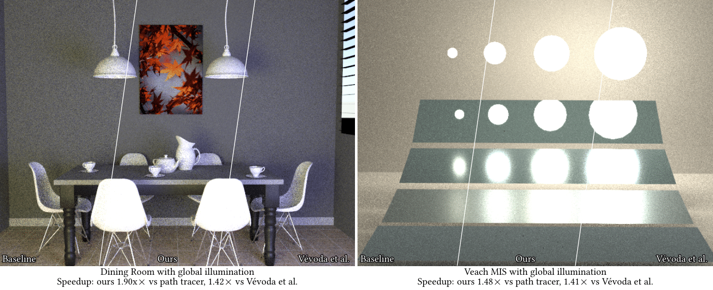
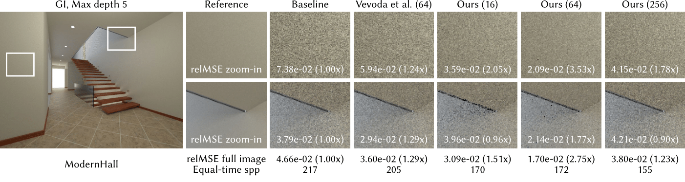

# Revisiting Controlled Mixture Sampling for Rendering Applications



A reference implementaion of the paper ["Revisiting Controlled Mixture Sampling for Rendering Applications"](https://graphics.cg.uni-saarland.de/publications/hua-2023-sig-cms.html) by [Qingqin Hua](https://graphics.cg.uni-saarland.de/people/hua.html),  [Pascal Grittmann](https://graphics.cg.uni-saarland.de/people/grittmann.html) and [Philipp Slusallek](https://graphics.cg.uni-saarland.de/people/slusallek.html), SIGGRAPH 2023.

The implementaion contains our path tracing application (Section 6 and 7): Control variate formulate with per-light sampling technique and Bsdf sampling technique in global illumination.

## Dependencies
The project is based on [SeeSharp v1.9.0](https://github.com/pgrit/SeeSharp) and [.NET 7.0](https://dotnet.microsoft.com/download)

## Running
Simply run 
```
cd ControlledMixtureSampling
dotnet run -c Release
```

The code generates both equal-Spp results and equal-time results for our per-light path tracing results. You can view the results under `ControlledMixtureSampling\bin\Release\net7.0\Results\PT`.

We tested our code on Windows (Visual Studio 2022 Win64). It should be runnable on x86-64 Windows, Linux, and macOS by easily run the same commands above. Please follow [SeeSharp](https://github.com/pgrit/SeeSharp) for detailed compliation instructions.

## Example Results
`MakeFigures` provides two python scripts to generate figures. 
- `MakeFigures\MakeFigure8.py` generates Fig. 8 in the paper. 
- `MakeFigures\MakeSupplemental.py` generates supplemental for different spatial grid resolutions. You can also download the supplemental [here](https://graphics.cg.uni-saarland.de/papers/hua-2023-sig-cms-supplemental.zip).

Below shows an equal-time result of ours in the setting of different grid resolution in full GI.

